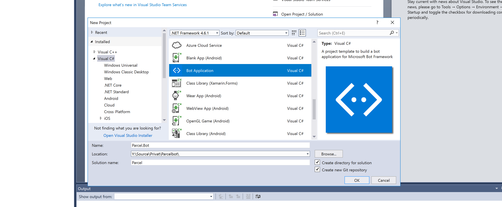

# Parcel Bot Demo

## Instructions
### Prepare your environment

- Download Bot Templates for Visual Studio
- Downlaod Bot Emulator

### Create a new project


### Create a ParcelTracking model

```csharp
[Serializable]
public class ParcelTracking
{
    [Prompt("What is your {&}?")]
    [Describe("Package Tracking Number")]
    public string TrackingNumber;
}
```

### Create a LUIS Dialog

```csharp
[LuisModel("LUIS_APP_ID", "LUIS_KEY", domain: "westeurope.api.cognitive.microsoft.com")] 
[Serializable]
public class LuisDialog : LuisDialog<ParcelTracking>
{
    [LuisIntent("Greeting")]
    public async Task Greeting(IDialogContext context, LuisResult result)
    {
        await context.PostAsync("Hi, ich bin der DPD Bot. Wie kann ich helfen?");
        context.Wait(MessageReceived);
    }
}
```

### Route incoming requests to LUIS Dialog
**MessageController.cs**
```csharp
if (activity.Type == ActivityTypes.Message)
{
    //await Conversation.SendAsync(activity, () => new Dialogs.RootDialog());
    await Conversation.SendAsync(activity, () => Chain.From(() => new Dialogs.LuisDialog()));
}
else
{
    HandleSystemMessage(activity);
}
```

## LUIS

- If you want to host LUIS in Europe, create a New App at https://eu.luis.ai/applications
- If oyu want to host LUIS in US, create a New App at https://luis.ai/applications


## Publish the bot
### Create a new Azure API App
## 

## Publish Bot Code to app


### Register your bot
https://dev.botframework.com/bots

- Register an existing bot
- Endpont: http**s**://YOURBOTURL.azurewebsites.net
- Create Microsoft App ID and password button
- Copy App Id to Azure Portal -> Api App -> Application Settings -> App settings -> MicrosoftAppID
- Confirm
- Copy Password to Azure Portal -> Api App -> Application Settings -> App settings -> MicrosoftAppPassword
- Click Finish
- Register


# Legal
Parcel Icon from: <a href="https://icons8.com">Icon pack by Icons8</a>